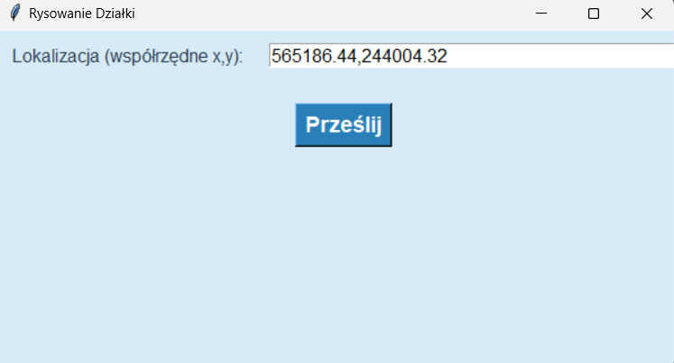
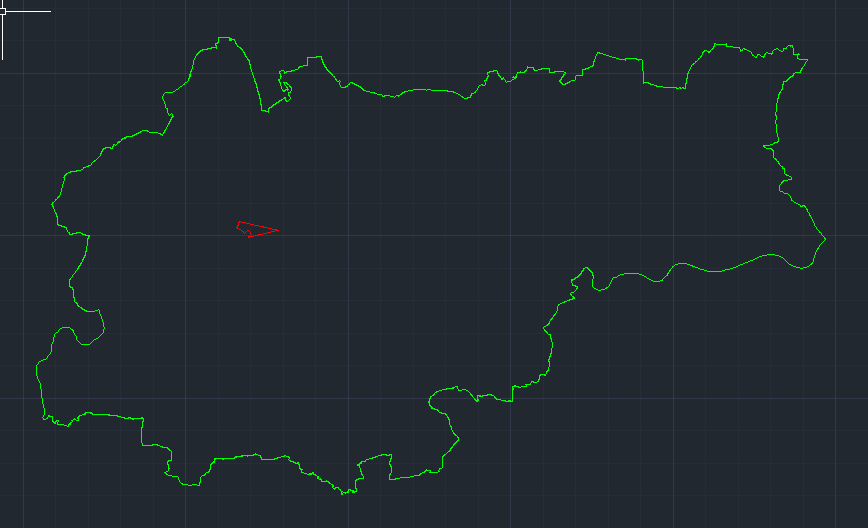
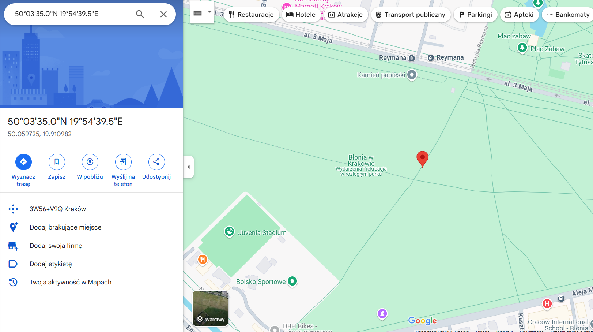

# Automatyzacja CAD z użyciem Tkinter i AutoCAD

Projekt ten pozwala na automatyzację procesu rysowania działek i gmin w AutoCAD, wykorzystując dane przestrzenne w formacie WKB. Aplikacja umożliwia pobranie danych działki oraz gminy na podstawie współrzędnych geograficznych, a następnie rysowanie ich na mapie w AutoCAD. Wszystko to z pomocą interfejsu graficznego stworzonego za pomocą biblioteki Tkinter.

## Funkcje

- **Pobieranie danych działki** z systemu GUGiK na podstawie współrzędnych geograficznych.
- **Pobieranie danych gminy** z systemu GUGiK na podstawie współrzędnych geograficznych.
- **Rysowanie działki i gminy w AutoCAD** na podstawie otrzymanych danych w formacie WKB.
- **Konwersja współrzędnych** z układu EPSG:2180 na EPSG:4326.
- **Otwieranie lokalizacji w Google Maps** w celu wizualizacji danych geograficznych.

## Wymagania

Aby uruchomić projekt, potrzebne są pakiety zawarte w pliku `requirements.txt`.

## Jak używać

1. Uruchom plik `main.py`.
2. Wprowadź współrzędne lokalizacji działki lub gminy w formacie x,y (np. 565186.44,244004.32).
3. Kliknij przycisk **"Prześlij"**, aby:
   - Pobrać dane o działce i gminie.
   - Narysować działkę i gminę w AutoCAD na podstawie otrzymanych danych.
   - Otworzyć lokalizację na mapie Google.

## Przykład działania

Po uruchomieniu aplikacji użytkownik wpisuje współrzędne lokalizacji (np. 565186.44,244004.32), a aplikacja:

1. Pobiera dane działki i gminy z systemu GUGiK.
2. Rysuje działkę i gminę w AutoCAD na podstawie tych danych. 
3. Otwiera lokalizację w Google Maps w celu dodatkowej weryfikacji. 

## Wnioski

Projekt został wykonany w ramach zajęć "Automatyzacja w Technikach CAD" na Akademii Górniczo-Hutniczej w Krakowie, IGP II. Zajęcia prowadził dr inż. Rafał Kocierz. 

Celem projektu było zautomatyzowanie procesu rysowania działek i gmin w AutoCAD, co pozwoliło na poznanie możliwości integracji różnych narzędzi CAD z danymi przestrzennymi oraz naukę pracy z biblioteką Tkinter w tworzeniu interfejsów graficznych. Dzięki wykonaniu tego projektu udało się osiągnąć pełną funkcjonalność pobierania danych z systemów zewnętrznych i ich wizualizacji, co stanowi cenne doświadczenie w kontekście rozwoju oprogramowania wspomagającego procesy inżynierskie.

Wykonał: Jakub Wilk
